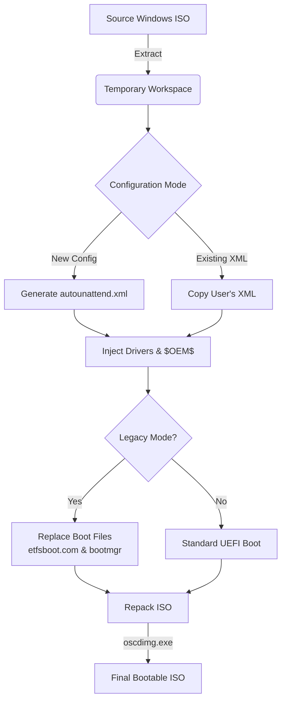

# WinISOBuilder - The Ultimate Unattended Installation Tool

> **Now you can build your unattended customized Windows image in an easy way... and in less time!** ⏱️✨

**WinISOBuilder** is a powerful, user-friendly C# WPF application designed to automate the creation of custom, unattended Windows 11 ISOs. It bridges the gap between complex PowerShell scripting and ease of use, providing a robust solution for IT administrators and enthusiasts.

## 🚀 Why Use WinISOBuilder?

Most ISO tools fail when it comes to **Legacy BIOS** compatibility or complex driver integrations. **WinISOBuilder** was built specifically to solve these "impossible" edge cases.

### ✨ Key Features & Benefits

1.  **Stop the Boot Loop (Legacy BIOS Fix)**
    *   **The Problem:** Modern Windows 11 ISOs often refuse to boot in Legacy/MBR mode, getting stuck in infinite loops or showing "Media Cannot Boot" errors.
    *   **Our Solution:** WinISOBuilder intelligently injects compatible boot files (`etfsboot.com`, `bootmgr`) from proven sources, ensuring your ISO boots perfectly on standard BIOS machines and Gen1 VMs.

2.  **Smart Script Preservation**
    *   unlike other tools that overwrite your work, WinISOBuilder respects your existing `$OEM$` folders.
    *   It detects your custom `InstallApps.ps1`, `PostInstall.ps1`, and drivers, integrating them seamlessly into the final build without modification.

3.  **"Use Existing" Mode**
    *   Have a verified `autounattend.xml` that you trust?
    *   One checkbox tells the app to skip its own generation logic and wrap your perfect config into a bootable ISO.

4.  **Automated Post-Install Magic**
    *   Injects a "Welcome" message to confirm successful deployment.
    *   Handles Windows Updates, BitLocker, and user creation automatically.

## 🛠️ How It Works (The Logic Flow)

WinISOBuilder automates the complex `DISM` and `oscdimg` chains into a simple pipeline:

## 🧩 Technical Highlights

*   **Robust Extraction**: Uses `Robocopy` logic to ensure zero file loss (handling hidden system files that standard copy instructions miss).
*   **Zero Dependencies**: The provided installer is **Self-Contained**, meaning it runs on any Windows PC without needing you to install .NET runtimes manually.
*   **Clean UI**: A modern WPF interface that hides the complexity of command-line arguments and XML syntax.

---

**Empower your deployments with WinISOBuilder.**
*Simple enough for beginners, powerful enough for SysAdmins.*

---

## 👨‍💻 About the Developer

**Created and Developed by Mohammad S. AbuHammad**

*   💼 **LinkedIn**: [mohd-abuhammad](https://www.linkedin.com/in/mohd-abuhammad/)
*   💻 **GitHub**: [mohdsabuhammad](https://github.com/mohdsabuhammad)
