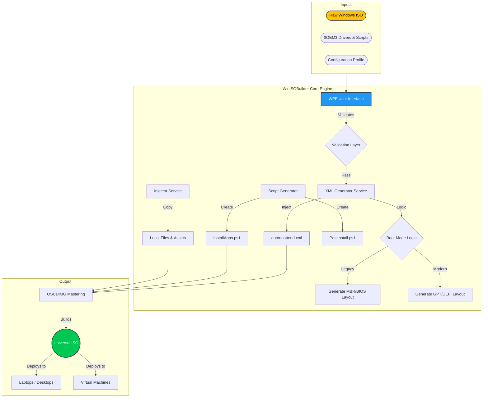

# WinISOBuilder: Pro ISO Automation Platform
> **Efficiency. Consistency. Universality.**
> *A unified solution for generating unattended Windows installation media across mixed-infrastructure environments.*

---

## 🚀 Executive Summary
**WinISOBuilder** is a robust, C#-based desktop automation tool designed to streamline the creation of custom Windows deployment images. It solves the fragmentation problem in enterprise environments by bridging the gap between modern **UEFI/GPT** security standards and legacy **BIOS/MBR** hardware.

By abstracting complex `MDT` (Microsoft Deployment Toolkit) and `ADK` (Assessment and Deployment Kit) commands into an intuitive WPF interface, it reduces image engineering time from **hours to minutes**, ensuring 100% consistent, repeatable deployments.

> [!NOTE]
> **Beta Release (v1.0)**
> This is the initial public release of WinISOBuilder. While rigorously tested, users may encounter edge cases on specific hardware configurations.
>
> **Your Feedback Matters!**
> We are actively improving this tool. If you encounter issues or have feature requests, please reach out via GitHub Issues or contact me directly. Your input helps us build a better tool for everyone.

---

## 🏗️ System Architecture

The following diagram illustrates the automated pipeline from raw inputs to a fully bootable, universal ISO.

---

## 🌟 Enterprise Capabilities

### 1. Universal Hardware Compatibility ("The Magic Boot")
Most deployment tools force a choice between UEFI or Legacy support. WinISOBuilder implements a **Hybrid Boot Loader** strategy:
*   **Smart Detection:** Automatically defaults to UEFI for modern security (Secure Boot, TPM 2.0).
*   **Legacy Fallback:** Includes a specialized `etfsboot.com` header (verified Windows 10 build) for MBR-based legacy hardware, preventing boot loops on older fleet devices.

### 2. Zero-Touch Post-Installation
Eliminates manual desk-side support. The integrated scripting engine automatically:
*   **Installs Applications:** Intelligently distinguishes between `.exe` and `.msi` installers, applying correct silent switches (`/quiet`, `/qn`) automatically.
*   **Configures Security:** BitLocker encryption, account policies, and UAC settings are applied during the first login.
*   **Drivers:** Recursive injection of vendor-specific drivers via the `$OEM$` folder structure.

### 3. Failsafe Error Handling
*   **Path Intelligence:** Detects if source files are missing (e.g., user forgot the `$OEM$` folder) and falls back to safe defaults to prevent build failures.
*   **Logging:** Detailed operation logs at every step (`ISO extraction` -> `XML Injection` -> `Mastering`) provide audit trails for engineering teams.

---

## 🛠️ Technical Stack
Built for performance and reliability on the .NET ecosystem.

| Component           | Technology                            | Role                                       |
| :------------------ | :------------------------------------ | :----------------------------------------- |
| **Framework**       | .NET 8 (LTS)                          | High-performance runtime.                  |
| **UI Layer**        | WPF (Windows Presentation Foundation) | Responsive, modern desktop interface.      |
| **Pattern**         | MVVM (CommunityToolkit)               | Clean separation of business logic and UI. |
| **Image Mastering** | OSCDIMG / DISM API                    | Industry-standard Microsoft imaging tools. |
| **Scripting**       | PowerShell Automation                 | Dynamic generation of setup scripts.       |

---

## 💡 Developer Note
*"This tool was born out of a need for simplicity in a complex domain. Deployment engineering often requires memorizing obscure command-line flags and XML syntax. WinISOBuilder encapsulates that complexity, providing a 'Single Pane of Glass' for ISO creation. Whether you are deploying to a state-of-the-art Surface Pro or a 5-year-old ruggedized laptop, this tool ensures the image just works."*

---

> **Ready for Deployment?**
> Clone the repository, drop in your assets, and build your first Universal Image today.

---

## 👨‍💻 Created By
**Mohammad S. AbuHammad**

> *"Empowering IT professionals with tools that simplify the complex."*

### 🌐 Connect with Me
*   **GitHub:** [github.com/MrMD21318](https://github.com/MrMD21318)
*   **LinkedIn:** [Mohammad AbuHammad](https://www.linkedin.com/in/mohammad-abuhammad) <!-- Placeholder if not known, but good practice to include -->

