# Windows ISO Builder 🏗️

> **The Modern Tool for Automating Windows 11 Deployments**

**Windows ISO Builder** is a powerful WPF application designed to simplify the creation of custom, unattended Windows 11 installation media. Unlike complex proprietary tools or manual XML editing, this tool offers a beautiful **Fluent Design** interface to guide you through every step of the configuration process.


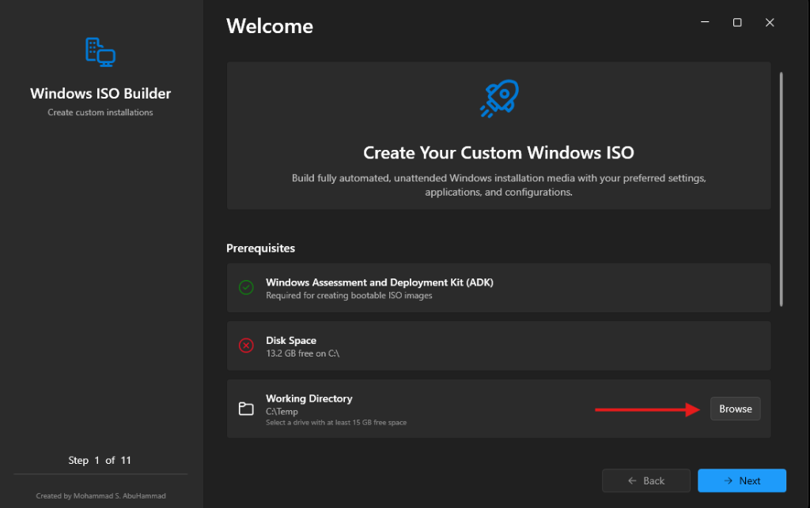
*(Click to view more screenshots)*

### 📸 Application Tour
|                                             |                                                     |                                                     |
| :-----------------------------------------: | :-------------------------------------------------: | :-------------------------------------------------: |
| 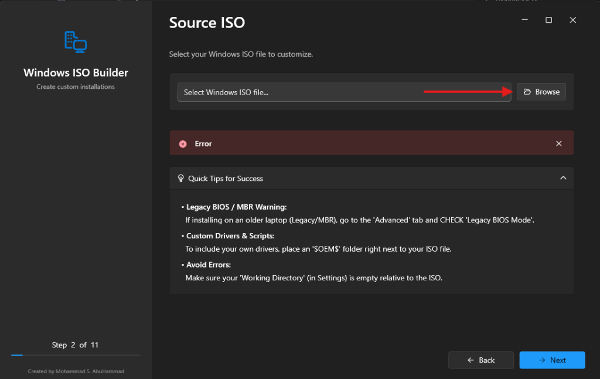 |       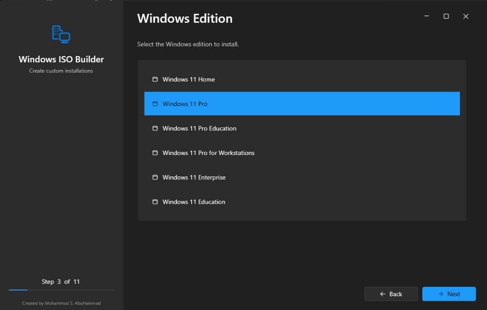        |   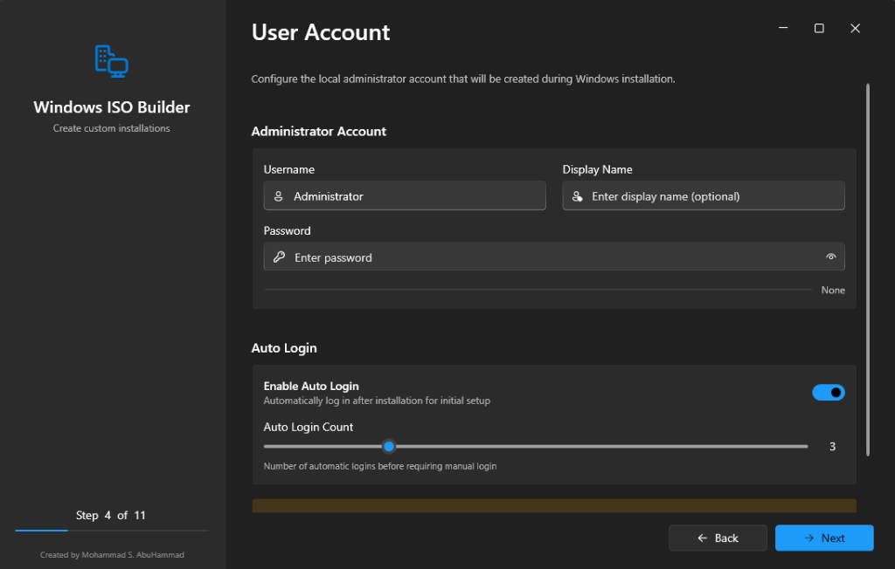   |
|              **1. Select ISO**              |                **2. Choose Edition**                |                **3. Configure User**                |
|  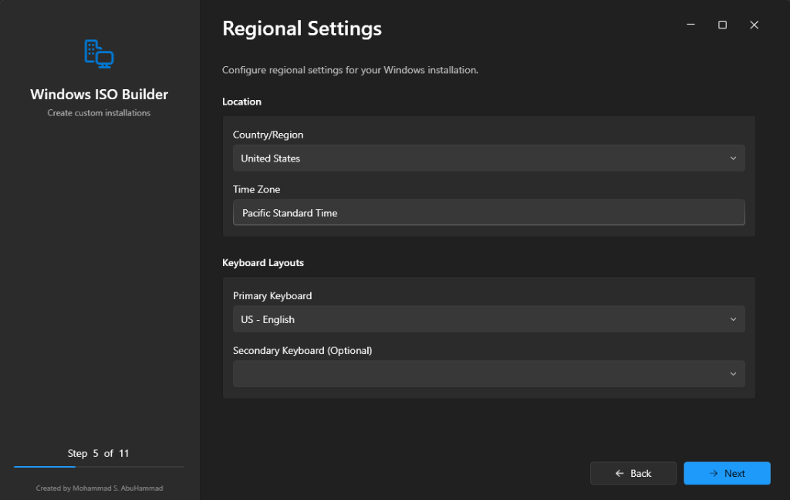   |  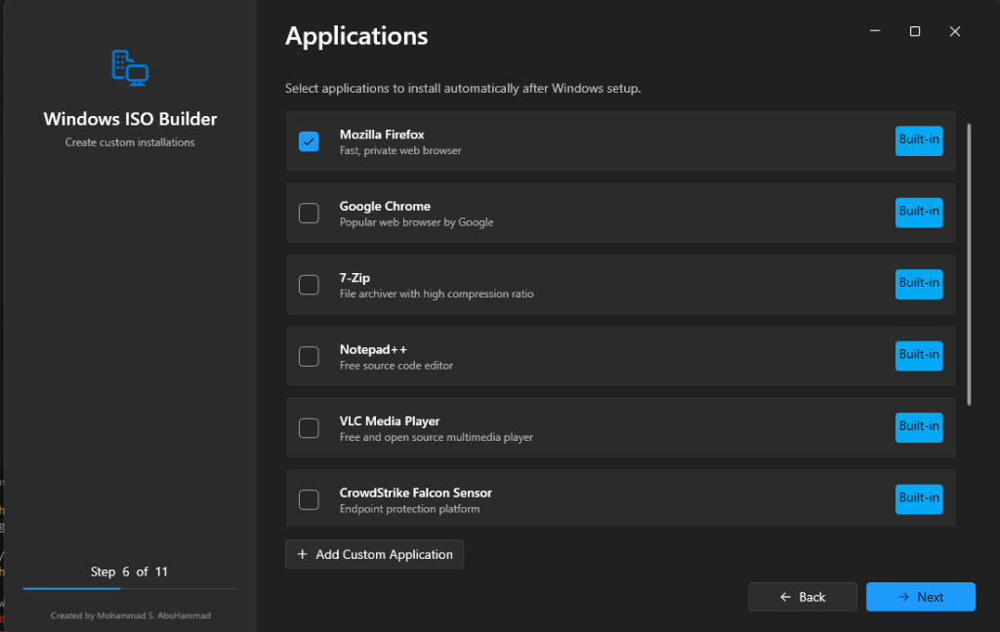   | 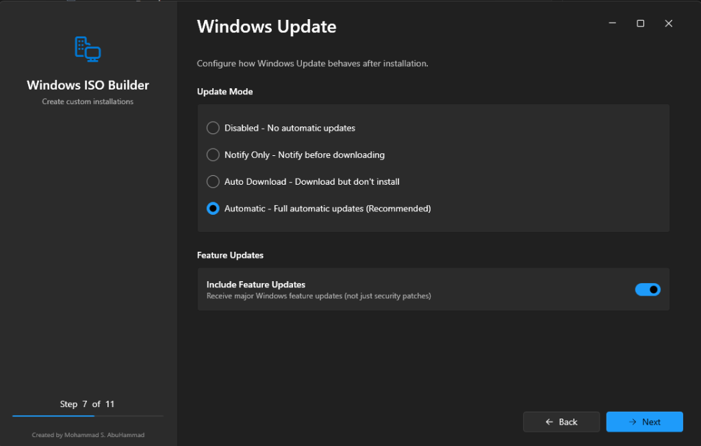 |
|          **4. Regional Settings**           |                 **5. Applications**                 |                **6. Windows Update**                |
|  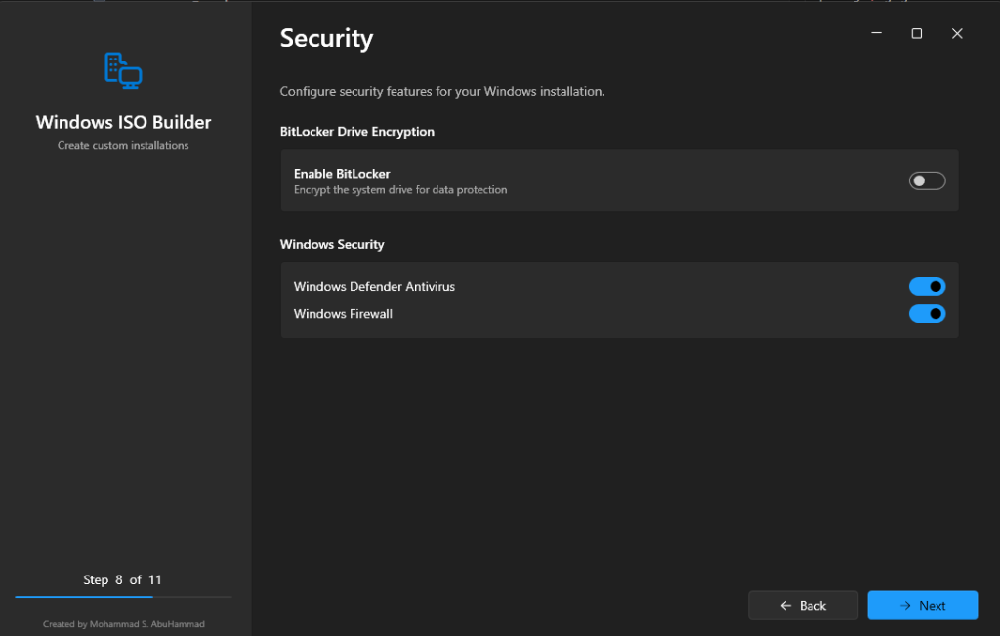   |             |       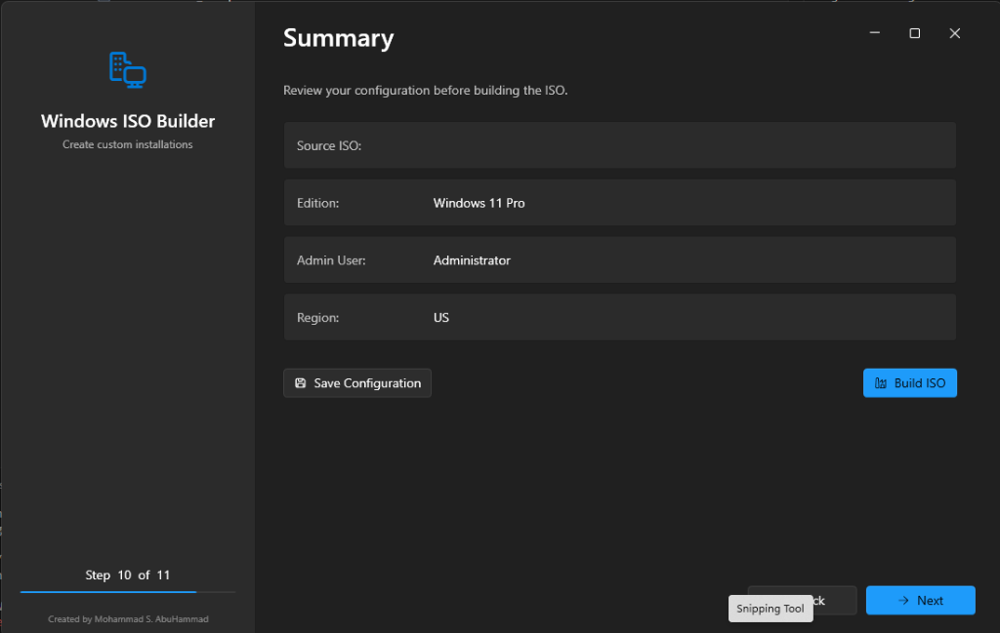        |
|               **7. Security**               |               **8. Advanced Options**               |                **9. Summary Review**                |
|  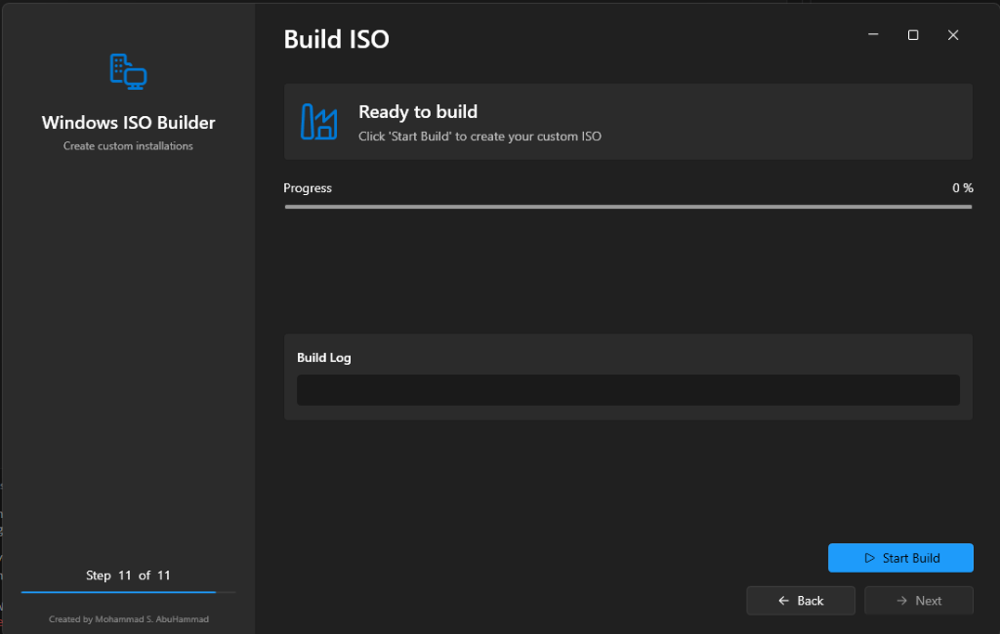   | 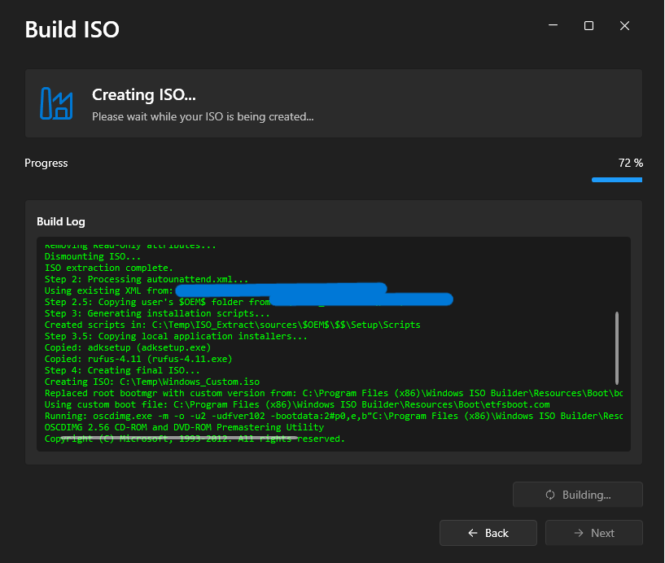 |                                                     |
|           **10. Ready to Build**            |            **11. Building in Progress**             |                                                     |


---

## 🌟 Why is this Tool Perfect? (Competitive Analysis)

Why choose **Windows ISO Builder** over existing solutions like NTLite, Rufus, or manual scripts?


**Windows ISO Builder is completely FREE.**

*   **No Hidden Costs**: All features, including advanced automation and customization, are free.
*   **No Premium Version**: There is no "Pro" version; you get the full power of the tool immediately.

**Key Advantages:**
1.  **"One-Click" Local App Integration**: Drag specific .exe/.msi files, and the tool automatically suggests silent install arguments (e.g., `/qn` for MSI).
2.  **Hybrid Installation**: Supports both **Online** (Download URL) and **Offline** (Bundled Installer) application methods in the same ISO.
3.  **Clean Codebase**: Built on modern .NET 8 and WPF, making it easy for developers to extend.

---

## 🚀 Key Features

### 1. 🎨 Modern Wizard Interface
*   Step-by-step guidance ensures you never miss a critical setting.
*   Clean, dark-mode friendly UI built with `WPF-UI`.

### 2. 📦 Application Management System
*   **Dual Installation Methods**:
    *   **Download URL**: Fetches the latest version during Windows setup (ensures freshness).
    *   **Local File**: Bundles the installer directly into the ISO (great for offline installs).
*   **Smart Argument Detection**: Automatically populates silent install flags (e.g., `/S`, `/quiet`, `/norestart`) based on file extension.
*   **Secure Arguments**: Safely handles complex keys (CIDs, License Keys) in command-line arguments.

### 3. 🛡️ Advanced Security & Automation
*   **Zero-Touch Deployment**: Automates OOBE (Out of Box Experience), Region, Language, and User Accounts.
*   **Security Defaults**: Configures BitLocker, Admin Accounts, and Windows Update policies automatically.
*   **Bypass Requirements**: Optional toggles to bypass TPM 2.0, Secure Boot, and RAM checks for legacy hardware/VMs.

### 4. 🧠 Intelligent Logic
*   **Edition Matching**: Automatically detects your Windows Edition (Home, Pro, Education) and applies the correct generic product key to **prevent installation crashes**.
*   **Dynamic Scripting**: Generates custom `InstallApps.ps1` and `PostInstall.ps1` scripts on the fly based on your selection.

---

## 🏗️ Architecture & Implementation Plan

The project follows a clean **MVVM (Model-View-ViewModel)** architecture ensuring separation of concerns and testability.

### High-Level Architecture

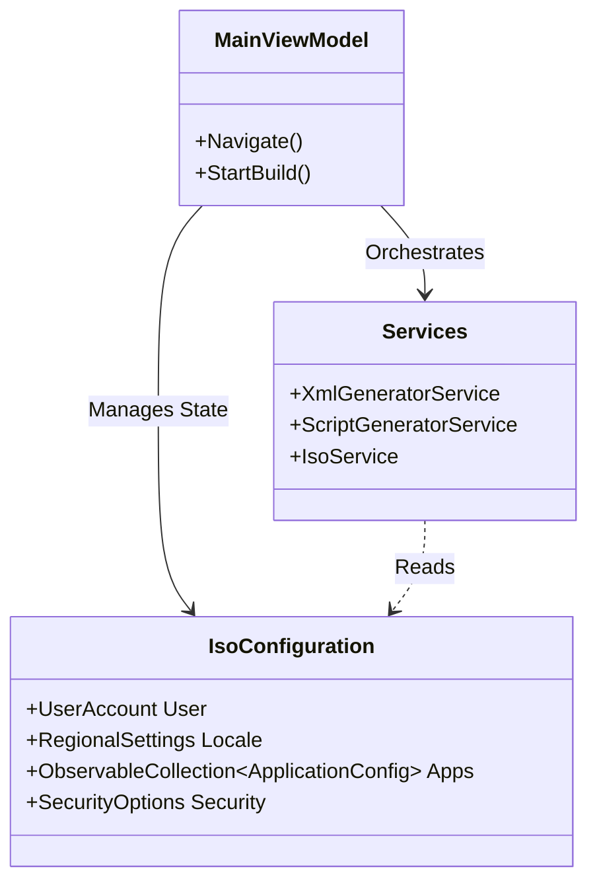

### Build Process Flow

The "Build" step orchestrates a complex pipeline to produce a production-ready ISO:

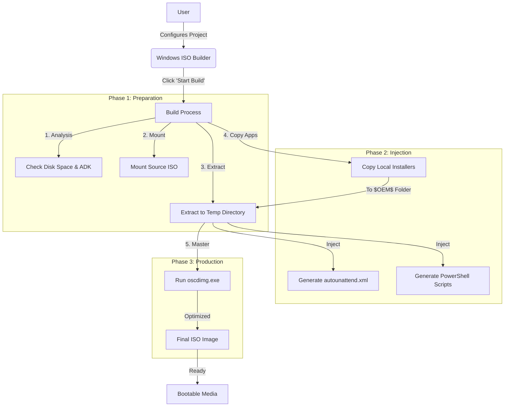

### Folder Structure Strategy

The tool structures the ISO usage of the `$OEM$` folder to enable seamless automation:

```text
ISO Root/
├── autounattend.xml                  <-- The Brain (Orchestrator)
├── setup.exe
└── sources/
    └── $OEM$/
        └── $$/
            └── Setup/
                ├── Files/            <-- Local Installers (copied here)
                │   ├── firefox.msi
                │   └── agent.exe
                └── Scripts/          <-- Generated Scripts
                    ├── InstallApps.ps1
                    └── PostInstall.ps1
```

---


> [!IMPORTANT]
> **BETA RELEASE (v1.0)**  
> This is the first public release of Windows ISO Builder. While we have tested it extensively, you may encounter bugs or issues.  
> Your feedback is valuable! Please report any issues you face so we can improve the tool.

## 💻 System Requirements

To ensure the tool runs correctly and can build ISOs, your system requires:

1.  **Windows 10 or Windows 11** (64-bit).
2.  **Administrator Privileges** (Required for mounting ISOs).
3.  **Windows Assessment and Deployment Kit (ADK)**:
    *   **Required for**: `oscdimg.exe` to create bootable ISOs.
    *   **Download**: The app will automatically check for this. If missing, please download the **Deployment Tools** feature from the [Microsoft ADK page](https://learn.microsoft.com/en-us/windows-hardware/get-started/adk-install).
4.  **Disk Space**: At least **15 GB** of free space for extracting and building the ISO.

---

## 📥 How to Install & Run

Since this is a packaged application, **you do NOT need to clone the repository or install Visual Studio.**

### Steps:
1.  **Download** the latest `WinISOBuilder_Setup.exe` from the repository files.
2.  **Run the Installer**: Double-click `WinISOBuilder_Setup.exe` to install the application.
3.  **Run as Administrator**:
    *   Once installed, locate **WinISOBuilder** in your Start Menu.
    *   Right-click and select **"Run as administrator"**.
    *   *Note: Administrator privileges are required to mount ISOs and perform disk operations.*

### ⚠️ Common Issues
*   **Antivirus/SmartScreen**: Since this is a new tool, Windows SmartScreen might flag it. Click "More Info" -> "Run Anyway" to proceed.
*   **ADK Missing**: The app will check for the Windows Assessment and Deployment Kit (ADK). If missing, it will prompt you to install it (required for creating ISOs).


---

## 👨‍💻 Developer

**Created by Mohammad S. AbuHammad**

*   💼 **LinkedIn**: [mohd-abuhammad](https://www.linkedin.com/in/mohd-abuhammad/)
*   💻 **GitHub**: [mohdsabuhammad](https://github.com/mohdsabuhammad)

---

> *This project is open for contributions! Feel free to fork, submit issues, or pull requests.*
