# 🖥️ Windows ISO Builder - Complete Feature Showcase

> **Enterprise-Grade Unattended Windows Installation Builder**  
> *Developed by Mohammad S. AbuHammad*

---

## 📋 Table of Contents

1. [Project Overview](#project-overview)
2. [Installation](#installation)
3. [Complete Wizard Walkthrough](#complete-wizard-walkthrough)
4. [Post-Installation Features](#post-installation-features)
5. [Technical Architecture](#technical-architecture)
6. [Author & Credits](#author--credits)

---

## 🎯 Project Overview

**Windows ISO Builder** is a professional WPF application that creates customized, unattended Windows 11 installation ISOs. It eliminates the need for manual configuration during Windows setup by pre-configuring:

- ✅ User accounts and passwords
- ✅ Regional settings and keyboard layouts
- ✅ Automatic application installation
- ✅ Security tool deployment (CrowdStrike, Netskope, Cortex XDR)
- ✅ Windows features and bloatware removal
- ✅ BitLocker encryption
- ✅ Domain join automation
- ✅ And much more!

### Key Benefits

| Feature                     | Benefit                                                 |
| --------------------------- | ------------------------------------------------------- |
| **Zero-Touch Installation** | Windows installs without any user interaction           |
| **Enterprise Ready**        | Supports domain join, security tools, GPO-ready configs |
| **Debloated Windows**       | Remove 35+ pre-installed apps automatically             |
| **Custom Apps**             | Pre-install any software during setup                   |
| **Security First**          | Deploy endpoint protection during installation          |

---

## 📥 Installation

1. **Download** `WinISOBuilder_Setup.exe` from the `Dist` folder
2. **Run** the installer as Administrator
3. **Launch** Windows ISO Builder from Start Menu

### Requirements

- Windows 10/11 (64-bit)
- Windows ADK (auto-detected, prompts to install if missing)
- Source Windows 11 ISO file
---

## 📊 Flow Diagrams

### Application Workflow (Wizard Steps)

```mermaid
flowchart TD
    A[🚀 Launch App] --> B[Step 1: Welcome]
    B --> C[Step 2: Select ISO]
    C --> D[Step 3: Choose Edition]
    D --> E[Step 4: User Account]
    E --> F[Step 5: Regional Settings]
    F --> G[Step 6: Applications]
    G --> H[Step 7: Windows Features]
    H --> I[Step 8: Windows Update]
    I --> J[Step 9: Security/BitLocker]
    J --> K[Step 10: Advanced Options]
    K --> L[Step 11: Summary Review]
    L --> M[Step 12: Build ISO]
    M --> N{Build Success?}
    N -->|Yes| O[📀 Custom ISO Ready]
    N -->|No| P[❌ Check Logs]
    O --> Q{Burn to USB?}
    Q -->|Yes| R[🔌 Launch Rufus]
    Q -->|No| S[📁 Open Folder]
```



### ISO Build Process


### Windows Installation Flow

```mermaid
flowchart TD
    subgraph "Phase 1: Windows Setup"
        A[🔌 Boot from USB/ISO] --> B[Windows PE Loads]
        B --> C[autounattend.xml Processed]
        C --> D[Disk Partitioned]
        D --> E[Windows Files Copied]
        E --> F[System Reboots]
    end
    
    subgraph "Phase 2: OOBE Bypass"
        F --> G[OOBE Skipped]
        G --> H[User Account Created]
        H --> I[Regional Settings Applied]
        I --> J[SetupComplete.cmd Triggered]
    end
    
    subgraph "Phase 3: Post-Install Scripts"
        J --> K[InstallApps.ps1]
        K --> L[SecurityApps.ps1]
        L --> M[PostInstall.ps1]
    end
    
    subgraph "Phase 4: Final Configuration"
        M --> N[Disable Services]
        N --> O[Remove Bloatware]
        O --> P[Domain Join Prompt?]
        P -->|Yes| Q[Join Domain & Restart]
        P -->|No| R[✅ Ready to Use]
        Q --> R
    end
```



### Script Execution Flow


### Security Apps Configuration


### Windows Features & Debloat Flow


---


## 🧙 Complete Wizard Walkthrough

The application uses a **12-step wizard** to guide you through creating a custom ISO.

---

### Step 1: Welcome Screen

**Purpose:** Introduction and quick start guide

**Features:**
- Displays application branding and version
- Quick tips for new users
- "Get Started" button to begin

---

### Step 2: Source ISO Selection

**Purpose:** Select your source Windows 11 ISO file

**Features:**
- Browse for local ISO file
- Displays ISO information (size, date)
- Validates ISO structure
- Supports all Windows 11 editions
- Tip: If your ISO doesn't appear, use "All files (*.*)" filter

---

### Step 3: Windows Edition

**Purpose:** Choose which Windows edition to install

**Options:**
- Windows 11 Home
- Windows 11 Pro *(most common)*
- Windows 11 Enterprise
- Windows 11 Education

---

### Step 4: User Account Configuration

**Purpose:** Configure the local administrator account

**Features:**
- **Username:** Set admin account name
- **Password:** Set admin password (with strength indicator)
- **Display Name:** Friendly name shown in Windows
- **Auto-Login:** Enable automatic login (configurable count)
- **Auto-Login Count:** Number of times to auto-login (1-999)

**Visual Indicator:**
- Password strength meter (Weak → Medium → Strong)

---

### Step 5: Regional Settings

**Purpose:** Configure language, timezone, and keyboard layouts

**Features:**
- **Country/Region:** Select from 50+ countries
- **Timezone:** Auto-selected based on country
- **Primary Keyboard:** Main keyboard layout
- **Secondary Keyboard:** Optional additional layout

**Supported Countries Include:**
- United States, United Kingdom, Germany, France
- UAE, Saudi Arabia, Egypt, Jordan
- Japan, China, India, Australia
- And many more...

---

### Step 6: Applications

**Purpose:** Configure applications to install automatically after Windows setup

**Built-in Apps (Download Automatically):**
- Google Chrome
- Mozilla Firefox
- 7-Zip
- Notepad++
- VLC Media Player

**Security Applications (Enterprise):**
- **CrowdStrike Falcon Sensor** - Prompts for CID
- **Netskope Client** - Prompts for Token and Hostname
- **Cortex XDR** - Prompts for installer file

**Custom Applications:**
- Add any `.exe` or `.msi` installer
- Specify silent install arguments
- Choose between download URL or local file

**How Security Apps Work:**
1. Enable the security app checkbox ☑️
2. Enter required parameters (CID, Token, etc.)
3. Browse to select the installer file
4. App is automatically installed with correct arguments

---

### Step 7: Windows Features (NEW!)

**Purpose:** Disable Windows services and remove bloatware apps

**Services to Disable:**

| Service                     | Description                     |
| --------------------------- | ------------------------------- |
| Telemetry & Data Collection | Stops Microsoft data collection |
| Cortana                     | Disables voice assistant        |
| Xbox Services               | Disables gaming features        |
| OneDrive                    | Disables cloud sync             |
| Windows Search              | Disables indexing service       |
| Print Spooler               | Disables print service          |
| Remote Desktop              | Disables RDP access             |
| Widgets                     | Removes taskbar widgets         |
| Hyper-V                     | Disables virtualization         |
| Windows Defender            | ⚠️ Not recommended               |

**Removable Built-in Apps (35+ apps):**

| Category      | Apps                                        |
| ------------- | ------------------------------------------- |
| Gaming        | Xbox App, Xbox Game Bar, Xbox Identity      |
| Communication | Mail & Calendar, People, Skype, Phone Link  |
| Entertainment | Groove Music, Movies & TV, Spotify, Disney+ |
| Productivity  | Office Hub, Sticky Notes, OneNote, To Do    |
| News          | Weather, News, Tips, Get Help               |
| Media         | Photos, Camera, Voice Recorder, Clipchamp   |
| Bloatware     | McAfee, Adobe CC Express                    |

**Quick Actions:**
- **Select All** - Remove all bloatware
- **Deselect All** - Keep all apps

---

### Step 8: Windows Update

**Purpose:** Configure Windows Update behavior

**Update Modes:**
- **Automatic** - Windows manages updates
- **Notify Only** - Download but don't install
- **Manual** - Disable automatic updates
- **Disabled** - Completely disable updates

**Additional Options:**
- Include Feature Updates
- Scheduled Install Time

---

### Step 9: Security Settings

**Purpose:** Configure BitLocker and security features

**BitLocker Options:**
- **Enable BitLocker** - Encrypt system drive
- **Encryption Method:** AES-128 or AES-256
- **Recovery Key Backup:**
  - Save to File
  - Backup to Active Directory

**Additional Security:**
- Enable Windows Defender
- Enable Windows Firewall

---

### Step 10: Advanced Options

**Purpose:** Advanced configuration for power users

**Options:**
- **Use Existing autounattend.xml** - Use your own XML file
- **Legacy BIOS Mode** - For older hardware (MBR partitioning)
- **Skip OOBE** - Skip Out-of-Box Experience
- **Custom OEM Folder** - Include custom files in ISO
- **Custom Scripts** - Add PowerShell scripts to run during setup

---

### Step 11: Summary

**Purpose:** Review all settings before building

**Displays:**
- Source ISO path
- Selected edition
- User account info
- Regional settings
- Applications to install
- Security settings
- Advanced options

**Actions:**
- Go back to modify settings
- Proceed to build

---

### Step 12: Build

**Purpose:** Create the custom ISO

**Build Process:**
1. Extract source ISO
2. Copy OEM files (if any)
3. Generate installation scripts
4. Copy local installers
5. Create final ISO with oscdimg.exe
6. Cleanup temporary files

**Build Log:**
- Real-time progress display
- Detailed logging of each step
- Error reporting

**Post-Build Options:**
- **Open Folder** - Navigate to output ISO
- **Burn to USB** - Launch Rufus with ISO pre-loaded

---

## 🔧 Post-Installation Features

These features execute **after** Windows is installed:

### Automatic Application Installation

**Script:** `InstallApps.ps1`

- Downloads apps from URLs or uses local installers
- Runs silent installations with configured arguments
- Logs all installation results to `C:\Windows\Logs\AppInstall.log`

### Security Apps Installation

**Script:** `SecurityApps.ps1`

- Separate script for enterprise security tools
- Correct installation commands:
  - **CrowdStrike:** `WindowsSensor.exe /install /quiet /norestart CID=xxx`
  - **Netskope:** `msiexec /i NSClient.msi TOKEN=xxx HOSTNAME=xxx /qn /norestart`
  - **Cortex XDR:** `msiexec /i CortexXDR.msi /qn /norestart`

### Windows Features Configuration

**Script:** `PostInstall.ps1`

- Disables selected services
- Applies registry tweaks (Cortana, OneDrive, Widgets)
- Removes selected bloatware apps using `Remove-AppxPackage`

### Domain Join (Interactive)

**Final Step in PostInstall.ps1**

```
============================================
DOMAIN JOIN CONFIGURATION
============================================
Do you want to join this machine to a domain? (Y/N): _
```

If **Y**:
1. Prompts for **PC Name**
2. Prompts for **Domain Name** (e.g., contoso.local)
3. Prompts for **Domain Admin Username**
4. Prompts for **Domain Admin Password**
5. Joins domain and **restarts automatically**

---

## 🏗️ Technical Architecture

### Technology Stack

| Component    | Technology                        |
| ------------ | --------------------------------- |
| Framework    | .NET 8.0 (Windows)                |
| UI           | WPF with WPF-UI (Modern Controls) |
| MVVM         | CommunityToolkit.Mvvm             |
| DI           | Microsoft.Extensions.Hosting      |
| ISO Creation | oscdimg.exe (Windows ADK)         |
| Installer    | Inno Setup 6                      |

### Project Structure

```
WinISOBuilder/
├── Models/           # Data models (IsoConfiguration, etc.)
├── ViewModels/       # MVVM ViewModels
├── Views/            # XAML pages
├── Services/         # Business logic
│   ├── IsoService.cs           # ISO extraction/creation
│   ├── XmlGeneratorService.cs  # autounattend.xml generation
│   ├── ScriptGeneratorService.cs # PowerShell scripts
│   └── NavigationService.cs    # Wizard navigation
├── Helpers/          # Converters and utilities
└── Assets/           # Icons and images
```

### Generated Files

| File              | Location                | Purpose                    |
| ----------------- | ----------------------- | -------------------------- |
| autounattend.xml  | ISO root                | Windows unattended config  |
| InstallApps.ps1   | \$OEM$\$$\Setup\Scripts | App installation           |
| SecurityApps.ps1  | \$OEM$\$$\Setup\Scripts | Security tool installation |
| PostInstall.ps1   | \$OEM$\$$\Setup\Scripts | Post-install tasks         |
| SetupComplete.cmd | \$OEM$\$$\Setup\Scripts | Script orchestration       |

---

## 👨‍💻 Author & Credits

**Developed by:** Mohammad S. AbuHammad

| Platform | Link                                                          |
| -------- | ------------------------------------------------------------- |
| LinkedIn | [mohd-abuhammad](https://www.linkedin.com/in/mohd-abuhammad/) |
| GitHub   | [MrMD21318](https://github.com/MrMD21318)                     |

---

## 📄 Version History

| Version | Date     | Changes                                                             |
| ------- | -------- | ------------------------------------------------------------------- |
| 1.0     | 2025     | Initial release                                                     |
| 1.1     | Jan 2026 | Added Security Apps (CrowdStrike, Netskope, Cortex)                 |
| 1.2     | Jan 2026 | Added Windows Features page (debloat)                               |
| 1.3     | Jan 2026 | Added USB Burn integration, Domain Join, separated SecurityApps.ps1 |

---

> **Note:** This is a BETA release. Please test thoroughly before deploying in production environments.

---

*Thanks for using Windows ISO Builder! 🚀*
